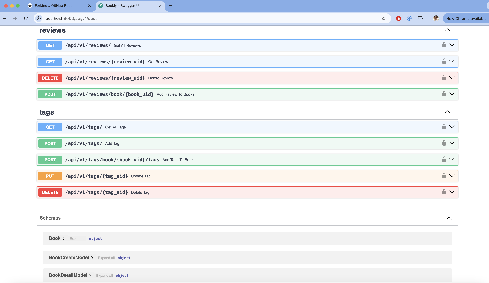

# 🚀 FastAPI Beyond CRUD - Conventional Commits & Semantic Versioning (SemVer) Validation  

This repository includes a **GitHub Actions Workflow** that enforces **Conventional Commits** and **Semantic Versioning (SemVer)** for all **Pull Requests (PRs).**  

For more details on FastAPI Beyond CRUD, visit the project's [website](https://jod35.github.io/fastapi-beyond-crud-docs/site/).

---

## 📌 Table of Contents

1. [Overview](#overview)  
2. [Features](#features)  
3. [Setup Instructions](#setup-instructions)  
4. [Testing Conventional Commit Validations](#testing-conventional-commit-validations)  
   - [Testing Bad PR Title](#1-testing-bad-pr-title)  
        - [Screenshots](#screenshots)  
   - [Testing Bad Commit Message](#2-testing-bad-commit-message)  
        - [Screenshots](#screenshots)  
   - [Testing Bad Commit Body](#3-testing-bad-commit-body)  
        - [Screenshots](#screenshots)  
5. [Testing Nightly Build & Docker Deployment](#testing-nightly-build--docker-deployment)  
6. [Run Application](#run-docker-entire-app)


---

## 📌 Overview

This project ensures that all pull requests comply with **Conventional Commits** and **Semantic Versioning (SemVer)** using **GitHub Actions**.  

It includes:  
✅ PR Title Validation  
✅ Commit Message Validation  
✅ PR Auto-Closure if validation fails  
✅ Email Notification on failure  
✅ Nightly Build & Docker Deployment  

---

## 🔹 Features

- **PR Title Validation**: Ensures PR titles follow the **Conventional Commit** format.
- **Commit Message Validation**: Every commit in a PR must adhere to **Conventional Commit & SemVer**.
- **PR Auto-Closure**: If a PR fails the validation, it is **automatically closed**.
- **Email Notification**: An email is sent to notify the user when a PR fails the validation.
- **Nightly Build**: Runs tests and builds the Docker image at **12 AM UTC**. If tests fail, the image is not pushed.

---

## 🔹 Setup Instructions  

### 1️⃣ **Move Required GitHub Secrets to .env**  

To prevent exposing credentials, simply run
```sh
    cp .env.example .env
```


---

## 🔹 Testing Conventional Commit Validations  

---

### 📌 **1. Testing Bad PR Title**  

1. **Make a commit**:
```sh
    echo "Add new test file" > test.txt
    git add test.txt
    git commit -m "feat: add login functionality"
    git push origin test-bad-pr-title
```
Here is a screenshot showing the PR failure after a bad PR title:


### 📌 **2. Testing Bad Commit Message**

1. **Make a commit with an invalid message**:
```sh
    echo "Testing bad commit message" > test.txt
    git add test.txt
    git commit -m "Updated something"
    git push origin test-bad-commit
```

Here is a screenshot showing the PR failure after a bad commit message:


### 📌 **3. Testing Bad Commit Body*

1. **Make a commit with an invalid body**:
```sh
    echo "Testing bad commit body" > test.txt
    git add test.txt
    git commit -m "feat: add login functionality" -m "Some random message without proper description."
    git push origin test-bad-commit-body
```

Here is a screenshot showing the PR failure after a bad commit message:


---

## 🔹 Running the Docker Application 

---

### 📌 1. Build and Start the Containers
1. **Test to Run the following command to build and start the application**:

```bash
    docker-compose up -d --build
```
You should see an output similar to this:


---

2. **📌Test to check all running containers:**:

```bash
    docker ps -a
```
You should see an output similar to this:

```bash
      ~/De/ass7/fastapi-beyond-CRUD on   main !3 ?3 ❯ docker ps  -a                          base at  14:13:30
        CONTAINER ID   IMAGE                        COMMAND                  CREATED          STATUS          PORTS                    NAMES
        60c53d48be7d   fastapi-beyond-crud-web      "uvicorn src.__init_…"   21 minutes ago   Up 21 minutes   0.0.0.0:8000->8000/tcp   fastapi-beyond-crud-web-1
        e18019297317   fastapi-beyond-crud-celery   "celery -A src.celer…"   21 minutes ago   Up 21 minutes   8000/tcp                fastapi-beyond-crud-celery-1
        9b40edcbc5ec   postgres:15                  "docker-entrypoint.s…"   22 minutes ago   Up 21 minutes   0.0.0.0:5432->5432/tcp   fastapi-beyond-crud-db-1
        d57efcdfbb6b   redis:6                      "docker-entrypoint.s…"   22 minutes ago   Up 21 minutes   0.0.0.0:6379->6379/tcp   fastapi-beyond-crud-redis-1
```
---

2. **📌Test to check Logs to Verify the Application is Running:**:

```bash
    docker logs fastapi-beyond-crud-web-1
```

Check logs for the FastAPI Web Service and You should see an output similar to this:

```bash
      ~/Desktop/ass7/fastapi-beyond-CRUD on   main !3 ?4 ❯ docker logs fastapi-beyond-crud-web-1                                        base at  14:25:31
        INFO:     Started server process [1]
        INFO:     Waiting for application startup.
        INFO:     Application startup complete.
        INFO:     Uvicorn running on http://0.0.0.0:8000 (Press CTRL+C to quit)1
```

```bash
    docker logs fastapi-beyond-crud-celery-1
```

Check logs for Celery Worker: and You should see an output similar to this:

```bash
      ~/Desktop/ass7/fastapi-beyond-CRUD on   main !3 ?4 ❯ docker logs fastapi-beyond-crud-celery-1                                                            base at  14:29:11
/usr/local/lib/python3.11/site-packages/celery/platforms.py:829: SecurityWarning: You're running the worker with superuser privileges: this is
absolutely not recommended!

Please specify a different user using the --uid option.

User information: uid=0 euid=0 gid=0 egid=0

  warnings.warn(SecurityWarning(ROOT_DISCOURAGED.format(
 
 -------------- celery@e18019297317 v5.4.0 (opalescent)
--- ***** ----- 
-- ******* ---- Linux-5.15.49-linuxkit-pr-x86_64-with-glibc2.36 2025-02-17 06:04:11
- *** --- * --- 
- ** ---------- [config]
- ** ---------- .> app:         __main__:0x7fafb8f0a2d0
- ** ---------- .> transport:   redis://redis:6379/0
- ** ---------- .> results:     redis://redis:6379/0
- *** --- * --- .> concurrency: 4 (prefork)
-- ******* ---- .> task events: OFF (enable -E to monitor tasks in this worker)
--- ***** ----- 
 -------------- [queues]
                .> celery           exchange=celery(direct) key=celery
                

[tasks]
  . src.celery_tasks.send_email

[2025-02-17 06:04:12,627: INFO/MainProcess] Connected to redis://redis:6379/0
[2025-02-17 06:04:12,634: INFO/MainProcess] mingle: searching for neighbors
[2025-02-17 06:04:13,657: INFO/MainProcess] mingle: all alone
[2025-02-17 06:04:13,692: INFO/MainProcess] celery@e18019297317 ready.
```

---

3. **📌Test to Open API Documentation in Browser:**:

Once the application is running, open your browser and go to:

```bash
    http://localhost:8000/api/v1/docs
```

You should see all API endpoints listed as expected in below scrrenshots.





---

## 🔹 Testing Nightly Build & Push to DockerHub

---
### 📌 **1. Testing Nightly Build Success**  

This Nightly Build will **send email notification** and image **cannot be stored in to Docker Hub registry** if test cases fails, and will only do so when all tests passed. 

This Nightly Build includes:  
✅ Set up jobs & checkout repositories  
✅ Set up Docker Compose  
✅ Log in to Docker Hub  
✅ Docker Compose Up and Run Tests  
✅ Build Docker Image  
✅ Push Docker Image to Registry  
✅ Install msmtp for email notifications  
✅ Send Failure Email Notification  
✅ Post Clean Up  

---

Testing Nightly Build on local manually, and this will trigger Nightly Build on Github Actions and you can track build status on Actions tab, simply run on local terminal:

```bash
    gh workflow run nightly-build.yml  
```

---

### 📌 **1. Set up jobs & checkout repositories**  

Here is a setting up the jobs pipeline and checkout the git repo


---

### 📌 **2. Set up Docker Compose**  

Here is a setting up and install docker compose make sure all software is available


---

### 📌 **3. Log in to Docker Hub**  

Here is a login to DockerHub


---

### 📌 **4. Docker Compose Up and Run Tests**  

Here is a running docker compose up build all container image and run the tests


---

### 📌 **5. Build Docker Image**  

Here is to build docker image


### 📌 **6. Push Docker Image to Registry**  

---

Here is push just built docker image to docker hub if tests all pass, and also shown Docker Hub page after image is pushed to registry.


---

Now checking if **Nightly Build** actually runs **every night at 12 AM UTC on schedule**:

In below screenshot, One build is **Trigger Manually** and one is **Schedules** which means **Nightly Build** is working as expected. 


---